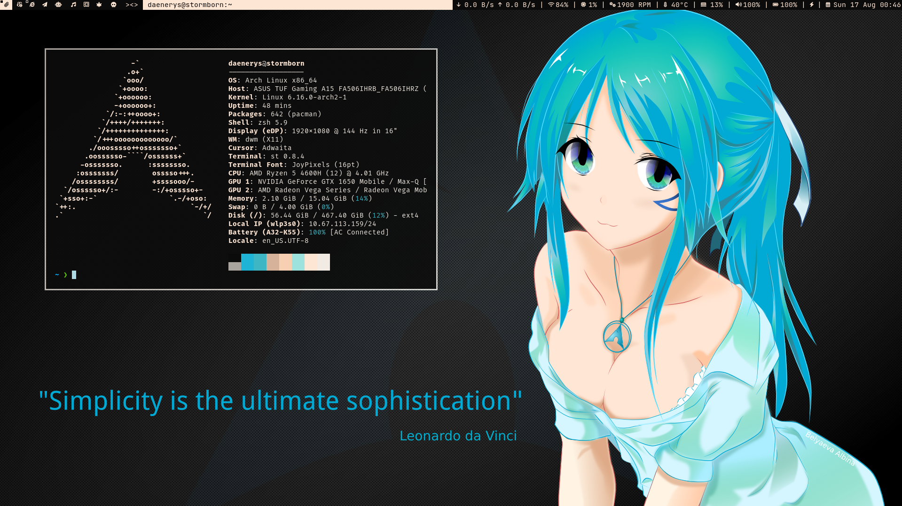

# Dotfiles – Arch Linux Rice
Heavily inspired by Luke Smith, Bugswriter and Suckless tools.
---

## System Overview

* **Base OS**: Arch Linux
* **Display Server**: Xorg
* **Window Manager**: dwm (patched with gaps, systray, swallow, centered master)
* **Status Bar**: slstatus (official suckless)
* **Terminal**: st (with scrollback, clipboard, font fallback)
* **Launcher**: dmenu (patched for fonts & looks)
* **Shell**: zsh + Oh My Zsh + Powerlevel10k
* **Editor**: Neovim with LazyVim starter config
* **Lockscreen**: betterlockscreen
* **Hotkey Daemon**: sxhkd
* **Display Config**: xrandr scripts for multi-monitor setups
* **Fonts**: FiraCode Nerd Font (Terminal)+ JetBrains Mono + JoyPixels emoji fallback

---
## Screenshot

 

## 1. Essentials

After booting into a TTY

```bash
sudo pacman -Syu
sudo pacman -S wget axel htop rsync tmux git unzip fzf openssh
```

---

## 2. AUR Helper (yay)

```bash
git clone https://aur.archlinux.org/yay.git
cd yay
makepkg -si
```

---

## 3. Shell Setup (zsh + oh-my-zsh + p10k)

```bash
sudo pacman -S zsh zsh-syntax-highlighting zsh-autosuggestions
chsh -s /bin/zsh
```

Install **oh-my-zsh**:

```bash
sh -c "$(curl -fsSL https://raw.githubusercontent.com/ohmyzsh/ohmyzsh/master/tools/install.sh)"
```

Install **Powerlevel10k**:

```bash
git clone --depth=1 https://github.com/romkatv/powerlevel10k.git \
  ${ZSH_CUSTOM:-$HOME/.oh-my-zsh/custom}/themes/powerlevel10k
```

`.zshrc` example:

```zsh
ZSH_THEME="powerlevel10k/powerlevel10k"

plugins=(
  git
  zsh-syntax-highlighting
  zsh-autosuggestions
)

source $ZSH/oh-my-zsh.sh
```

Then run:

```bash
p10k configure
```

---

## 4. Graphical Environment

### Xorg + utilities

```bash
sudo pacman -S xorg-server xorg-xinit xorg-xrandr xorg-xsetroot \
  xorg-xbacklight xorg-xinput xorg-xev sxhkd
```

### Touchpad config

File: `/etc/X11/xorg.conf.d/30-touchpad.conf`

```conf
Section "InputClass"
    Identifier "ELAN Touchpad"
    MatchProduct "ELAN1203:00 04F3:307A Touchpad"
    MatchIsTouchpad "on"
    Driver "libinput"
    Option "Tapping" "on"
    Option "NaturalScrolling" "true"
    Option "ClickMethod" "clickfinger"
    Option "TappingDrag" "true"
    Option "TappingDragLock" "true"
    Option "MiddleEmulation" "true"
EndSection
```

---

## 5. Suckless Setup

I keep source builds in `~/.local/src/`:

```bash
mkdir -p ~/.local/src
cd ~/.local/src

git clone https://git.suckless.org/dwm
git clone https://git.suckless.org/st
git clone https://git.suckless.org/dmenu
git clone https://git.suckless.org/slstatus
```

Compile:

```bash
cd dwm && sudo make clean install
cd ../st && sudo make clean install
cd ../dmenu && sudo make clean install
cd ../slstatus && sudo make clean install
```

### `.xinitrc`

```sh
#!/bin/sh

wal -R &             # restore pywal colors
slstatus &           # status bar
xset r rate 200 30 & # key repeat
sxhkd &              # hotkey daemon

exec dwm
```

---

## 6. Appearance & Fonts

```bash
sudo pacman -S python-pywal nerd-fonts-complete noto-fonts-emoji
sudo fc-cache -fv
```

Wallpaper/colors:

```bash
wal -i ~/pics/wallpapers/mywall.jpg
```

TTY font: `/etc/vconsole.conf`

```conf
FONT=Lat2-Terminus16
```

---

## 7. Applications

```bash
# Browsers
sudo pacman -S firefox

# Editors
sudo pacman -S vim neovim

# Media
sudo pacman -S mpv cmus cava

# Docs & Images
sudo pacman -S zathura zathura-pdf-mupdf sxiv feh

# File manager
sudo pacman -S ranger

# Clipboard
sudo pacman -S parcellite

# Screen locker (AUR)
yay -S betterlockscreen
```

Betterlockscreen example:

```bash
betterlockscreen -u ~/Pictures/wallpapers/lock.jpg
betterlockscreen -l
```

---

## 8. Hotkeys & Scripts

### sxhkdrc example

File: `~/.config/sxhkd/sxhkdrc`

```sh
super + Return
    st
super + Space
    dmenu_run

```

### xrandr example

File: `~/.local/bin/monitors/dual.sh`

```sh
#!/bin/sh
xrandr --output HDMI-1 --primary --mode 1920x1080 --rate 60 \
       --output eDP-1 --mode 1920x1080 --right-of HDMI-1
```

---

## 9. Neovim with LazyVim

LazyVim setup:

```bash
git clone https://github.com/LazyVim/starter ~/.config/nvim
rm -rf ~/.config/nvim/.git
```

Tweaks:

* Custom keymaps in `lua/config/keymaps.lua`
* Themes controlled via `:Lazy load`

---

## 10. Hardware (ASUS-specific)

```bash
yay -S asusctl
sudo pacman -S brightnessctl
```

Examples:

```bash
asusctl profile -P Performance
asusctl aura static
```

---

## Philosophy

I keep things **simple, minimal, and patched only where it matters**.
Suckless tools handle the core workflow.
Everything else is chosen to be lightweight and scriptable.

This README is both a **reference for myself** and a starting point for anyone who wants a clean minimal workflow on Arch.

---
